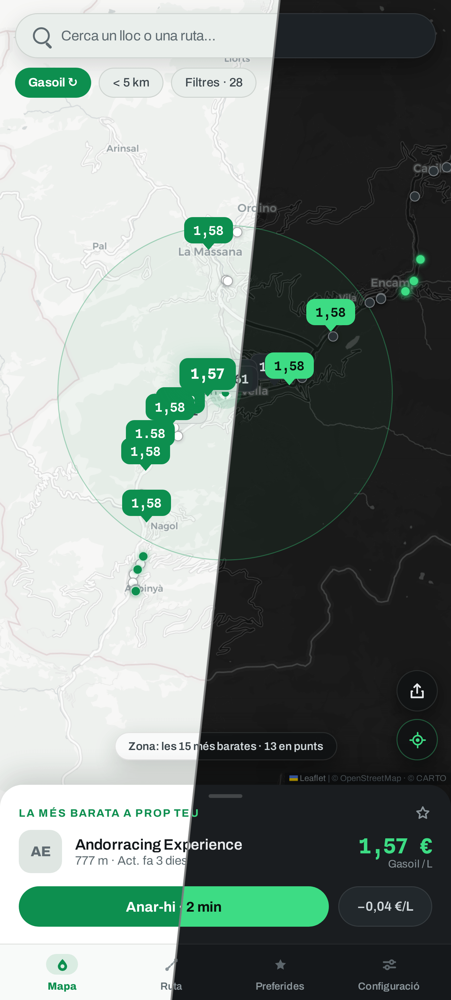
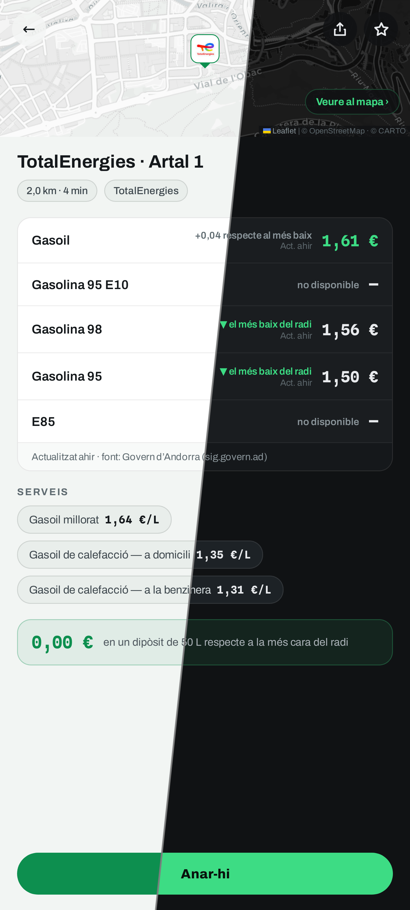
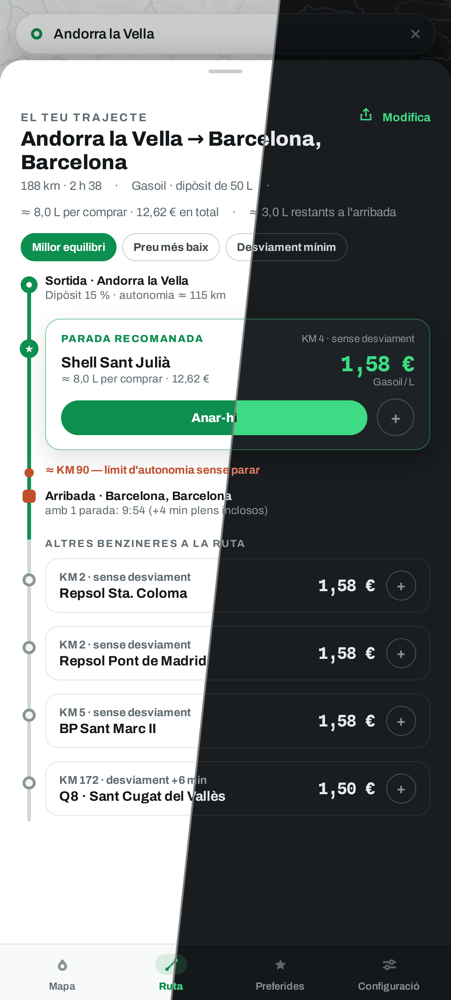

<div align="center">


# Plein.

**El dipòsit ple al preu just** — trobeu les benzineres més barates al vostre
voltant i al llarg dels vostres trajectes, a França, Espanya, Andorra i
Portugal.

[English](README.md) · [Français](README.fr.md) · [Español](README.es.md) · **Català** · [Português](README.pt.md)

[](https://plein.zadkiel.fr)

[](LICENSE)
[](#-ús)
[](#-fonts-de-dades)
[](https://react.dev)
[](https://www.typescriptlang.org)
[](https://leafletjs.com)

<br/>

| Els preus al vostre voltant | La fitxa d'una estació | Al vostre trajecte |
| :---: | :---: | :---: |
|  |  |  |

</div>

## ✨ Funcionalitats

- 🗺️ **Mapa de preus en directe** — les benzineres al vostre voltant, preus
  en xinxetes acolorides segons el preu: bones ofertes en verd, les més cares
  en taronja.
- 🇫🇷🇪🇸🇦🇩🇵🇹 **Quatre països en un mapa** — els fluxos oficials de França,
  Espanya, Andorra i Portugal combinats; els proveïments fronterers es
  comparen d'un cop d'ull.
- 📋 **Millor tria real** — el combustible cremat en el desviament es té en
  compte: una estació més propera pot guanyar la més barata.
- 🛣️ **Pla de proveïment en ruta** — on parar al llarg del viatge, quants
  litres a cada parada i a quin preu, segons 3 estratègies.
- ⭐ **Preferits** — les vostres estacions i el seu preu del dia, a través de
  zones i països.
- ⛽ **Tots els combustibles** — Dièsel, SP95/98, E10, E85, GLP; filtres per
  radi, marques, serveis i AdBlue.
- 🕐 **Horaris reals** — «Obert 24 h», «Tancat · obre a les 6.30» — amb la
  frescor dels preus assenyalada.
- 🏷️ **Marques reconegudes** — noms i logotips de les estacions des dels
  fluxos oficials i OpenStreetMap.
- 🧭 **«Com arribar-hi»** — obre l'estació a la vostra app de GPS.
- 🔗 **Enllaços compartibles** — l'adreça segueix el mapa i el trajecte; un
  enllaç reobre la mateixa vista.
- 🌗 **Tema clar i fosc** — segueix el navegador, modificable als Ajustos.
- 🌍 **Cinc llengües** — francès, anglès, espanyol, català i portuguès.
- 🖥️ **Mòbil i escriptori** — mapa a pantalla completa i plafó al mòbil,
  plafons laterals a la pantalla gran.
- 📱 **PWA instal·lable** — les últimes zones i tessel·les funcionen fora de
  línia.

## 🚀 Ús

1. Obriu **[plein.zadkiel.fr](https://plein.zadkiel.fr)** (el desplegament oficial).
2. Autoritzeu la geolocalització — o continueu sense i cerqueu una ciutat, a
   França, Espanya, Andorra o Portugal. La cerca recorda els llocs que hi heu
   triat: els proposa tan bon punt s'obre i els puja al capdamunt dels
   suggeriments així que escriviu.
3. Trieu el combustible a la part superior del mapa: la millor tria (preu I
   distància, desviament comptat) apareix al plafó inferior, **Com
   arribar-hi** inicia el guiatge.
4. Abans d'un viatge llarg, pestanya **Trajecte**: introduïu la destinació i
   compareu les estacions al llarg del recorregut.
5. Al mòbil, instal·leu l'app (bàner d'instal·lació o
   *Ajustos → Aplicació*) per tenir-la com a icona, a pantalla completa i
   fora de línia.

Cap compte, cap rastrejador: els vostres preferits i ajustos es queden al
vostre navegador.

## 📊 Fonts de dades

Cada país cobert té els seus propis fluxos oficials — preus i geocodificació
— que l'app tria segons la zona mostrada (font *Automàtica*). La resta
(itineraris, mapes base) és comuna als quatre.

### 🇫🇷 França

| Dada | Font | Llicència |
| --- | --- | --- |
| Preus dels carburants i horaris | [Prix des carburants — flux en temps real](https://data.economie.gouv.fr/explore/dataset/prix-des-carburants-en-france-flux-instantane-v2/) (data.economie.gouv.fr) | Licence Ouverte / Open Licence |
| Marques de les estacions | [OpenStreetMap](https://www.openstreetmap.org/) (índex estàtic generat, aparellat amb les estacions per proximitat) | ODbL |
| Geocodificació i autocompleció | [Base Adresse Nationale](https://adresse.data.gouv.fr/) (api-adresse.data.gouv.fr) | Licence Ouverte / Open Licence |

### 🇪🇸 Espanya

| Dada | Font | Llicència |
| --- | --- | --- |
| Preus dels carburants, horaris i marques | [Precios de carburantes](https://geoportalgasolineras.es) (sedeaplicaciones.minetur.gob.es, MITECO) — la marca (*rótulo*) l'aporta el flux | Datos abiertos |
| Geocodificació i autocompleció | [CartoCiudad](https://www.cartociudad.es) (IGN) | CC BY 4.0 |

### 🇦🇩 Andorra

| Dada | Font | Llicència |
| --- | --- | --- |
| Preus dels carburants i marques | [Preus dels carburants](https://sig.govern.ad/IPE/PreusCarburants) (sig.govern.ad, Govern d'Andorra — Oficina de l'Energia i del Canvi Climàtic) — la marca es dedueix del nom de l'estació; el flux no porta ni adreça ni horaris | © Govern d'Andorra |
| Geocodificació i autocompleció | Nomenclàtor (nomenclàtor oficial) & LocatorIDE (sig.govern.ad, IDE Andorra) | © Govern d'Andorra |

### 🇵🇹 Portugal

| Dada | Font | Llicència |
| --- | --- | --- |
| Preus dels carburants i marques | [Preços dos combustíveis](https://precoscombustiveis.dgeg.gov.pt) (DGEG — Direção-Geral de Energia e Geologia) — la marca (*marca*) l'aporta el flux, que no dona ni horaris ni E10; cobertura continental (les Açores i Madeira tenen el seu propi règim) | Dados abertos |
| Geocodificació i autocompleció | [Photon](https://photon.komoot.io) (instància pública de Komoot, índex OpenStreetMap), limitat al Portugal continental — el país no publica cap geocodificador d'adreces sense clau | ODbL |

### Comuns als quatre països

| Dada | Font | Llicència |
| --- | --- | --- |
| Càlcul d'itineraris | [OSRM](https://project-osrm.org/) (servidor de demostració) · [Valhalla](https://valhalla.github.io/valhalla/) (servidor públic FOSSGIS) per a «evitar autopistes / peatges» | © col·laboradors d'[OpenStreetMap](https://www.openstreetmap.org/copyright) |
| Mapes base | [CARTO](https://carto.com/attributions) clar / fosc segons el tema (tessel·les d'OpenStreetMap com a recurs fora de línia) | © col·laboradors d'[OpenStreetMap](https://www.openstreetmap.org/copyright) |

L'app no té **cap backend**: el navegador consulta directament aquests
serveis públics. Les fonts són connectables (`src/data/types.ts`). Sense
connexió o amb un flux caigut, l'app conserva les últimes estacions
carregades (memòria cau per zona) amb un bàner explícit i ho torna a provar
així que torna la connexió; el joc de dades de demostració fora de línia mai
no substitueix la font en silenci: els ajustos només l'ofereixen mentre la
font real falla, com a sortida explícita.

## 🛠️ Desenvolupament

Stack: **Vite · React 18 · TypeScript estricte · Leaflet**, sense cap altra
dependència de runtime. Desplegat a Cloudflare Workers (`wrangler`).

```bash
npm install
npm run dev          # http://localhost:5173
npm run build        # compilació de producció (dist/)
npm run e2e          # E2E Playwright: recorre totes les pantalles
npm run verify:live  # comprova els proveïdors reals (França, Espanya, Andorra, Portugal, geocodificadors, OSRM) contra els endpoints reals
npm run deploy       # build + wrangler deploy
```

Per afegir una font de dades: implementeu les interfícies
`StationsProvider` / `GeocodeProvider` / `RouteProvider` i registreu-la a
`src/data/providers.ts`.

En entorns sense accés directe a internet (sandbox, proxy corporatiu), el
servidor de desenvolupament de Vite fa de proxy per a les APIs (`/proxy/*`) i
les tessel·les (`/tiles/*`) respectant `HTTPS_PROXY` — vegeu
`vite.config.ts`.

## 📄 Llicència

Codi sota llicència [MIT](LICENSE) © Zadkiel Aharonian.
Les dades mostrades continuen subjectes a les llicències dels seus productors
respectius (Licence Ouverte per a les dades públiques franceses, datos
abiertos del MITECO per als preus espanyols, © Govern d'Andorra per a
Andorra, dados abertos de la DGEG per als preus portuguesos, ODbL per a
OpenStreetMap).
Les tipografies **Archivo** i **Spline Sans Mono**, incloses a
`public/fonts/`, estan sota la [SIL Open Font License 1.1](public/fonts/)
(vegeu els fitxers `*-OFL.txt` de la mateixa carpeta).
