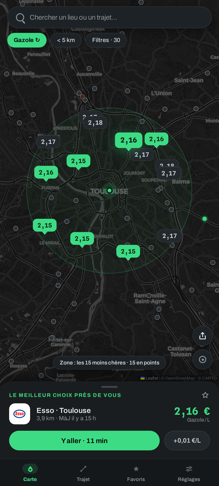
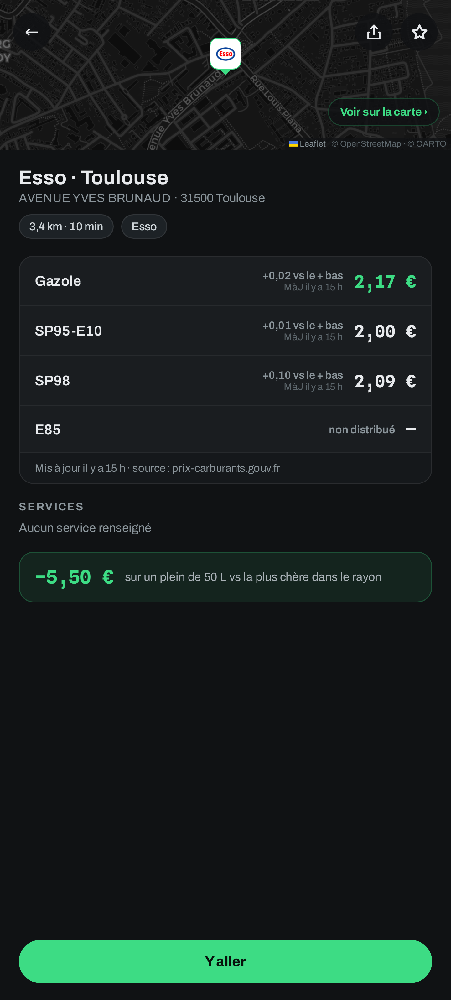
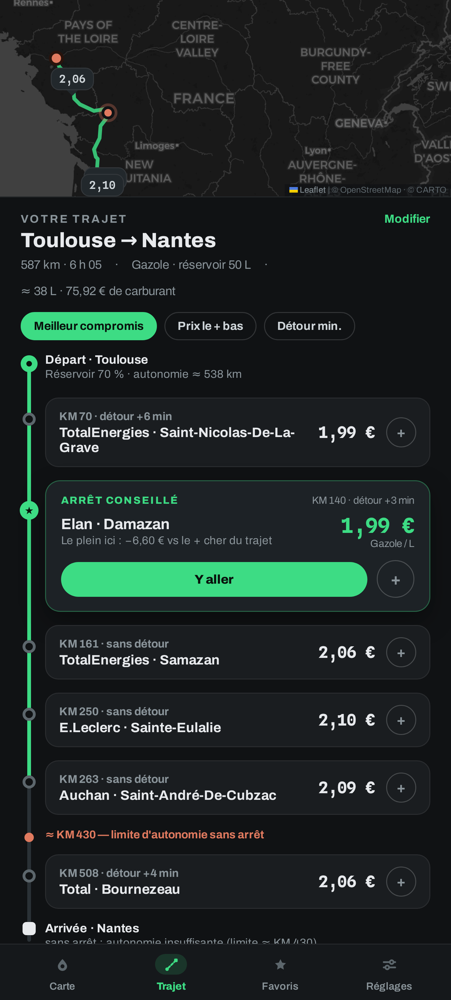

<div align="center">


# Plein.

**El depósito lleno al precio justo** — encuentra las gasolineras más baratas
a tu alrededor y a lo largo de tus rutas, en Francia, España, Andorra y
Portugal.

[English](README.md) · [Français](README.fr.md) · **Español** · [Català](README.ca.md) · [Português](README.pt.md)

[](https://plein.zadkiel.fr)

[](LICENSE)
[](#-uso)
[](#-fuentes-de-datos)
[](https://react.dev)
[](https://www.typescriptlang.org)
[](https://leafletjs.com)

<br/>

| Los precios a tu alrededor | La ficha de una estación | En tu ruta |
| :---: | :---: | :---: |
|  |  |  |

</div>

## ✨ Funcionalidades

- 🗺️ **Mapa de precios en directo** — las estaciones a tu alrededor con su
  precio en la chincheta, coloreadas según el precio: los «chollos» (todas las
  estaciones casi al mejor precio, no solo la primera) en verde, las más caras
  teñidas de naranja; mueve el mapa y las estaciones de la zona se cargan
  automáticamente, y en las zonas densas solo las más baratas conservan su
  burbuja de precio.
- 🇫🇷🇪🇸🇦🇩🇵🇹 **Cuatro países en el mismo mapa** — la fuente «Automática»
  combina los flujos oficiales de Francia, España, Andorra y Portugal según la
  zona mostrada: los repostajes fronterizos (Le Perthus, Irún, el Pas de la
  Casa, Vilar Formoso…) se comparan de un vistazo.
- 📋 **Lista de la zona** — desliza el panel inferior: todas las estaciones
  visibles, ordenadas por recomendación por defecto (precio o distancia a un
  toque), los chollos resaltados, sincronizadas con el mapa. La estación
  destacada es la **mejor elección real**: el combustible quemado en la ida y
  vuelta (consumo y depósito del perfil de vehículo de los Ajustes — coche o
  moto) se tiene en cuenta, así que una estación algo más cara pero mucho más
  cercana puede ganar a la más barata mostrada.
- 🛣️ **Plan de repostaje de la ruta** — salida desde «Mi posición» o cualquier
  dirección, autocompletado, mapa del corredor y **plan de repostaje** según
  3 estrategias (mejor compromiso · precio más bajo · desvío mínimo): una
  parada o varias encadenadas en los viajes largos, cada una con los litros a
  comprar, su coste y el desvío, desde el nivel del depósito a la salida hasta
  el combustible restante a la llegada. Fija o quita paradas para componer tu
  propio recorrido, evita autopistas o peajes, y los resultados llegan
  progresivamente — primero el itinerario, luego las estaciones, luego el
  plan.
- ⭐ **Favoritos** — fija tus estaciones y consulta su precio del día de un
  vistazo; siguen con precio incluso a través de zonas y países.
- ⛽ **Todos los combustibles** — Diésel, SP95/98, E10, E85, GLP; filtros por
  radio, rótulos, tipo de distribuidor y servicios (24 h, lavado, tienda,
  inflado, aditivos). El filtro **AdBlue** solo aparece donde la fuente
  publica la información: los flujos español y andorrano declaran los
  productos a la venta (y su precio, mostrado en la ficha), los flujos francés
  y portugués no dicen nada al respecto, así que sus estaciones siguen
  listadas en lugar de ocultarse por error. Como el E10 casi no existe fuera
  de Francia, las estaciones españolas, andorranas y portuguesas muestran su
  SP95 (compatible con E10) en el mapa E10 — con la etiqueta «SP95 / L» para
  dejarlo claro.
- 🕐 **Horarios reales** — «Abierto 24 h», «Cerrado · abre a las 6:30»…
  calculados a partir de los horarios oficiales; frescura de los precios
  mostrada (y señalada cuando envejecen).
- 🏷️ **Marcas reconocidas** — logotipos y nombres de las estaciones
  (TotalEnergies, E.Leclerc, Intermarché… y Repsol, Cepsa, Galp, Prio en el
  lado español, andorrano y portugués) emparejados desde OpenStreetMap en
  Francia (posiciones ajustadas a las coordenadas OSM reales), aportados
  directamente por los flujos oficiales en el resto.
- 🧭 **«Cómo llegar»** — abre el lugar en tu app de GPS: selector de app en
  Android (`geo:`), Mapas en iOS, Google Maps en escritorio; recorrido
  multiparada posible.
- 🔗 **Enlace compartible** — la dirección de la página sigue al mapa (zona
  mostrada, zoom, combustible, radio y filtros) y a la ruta (etapas y
  opciones): el botón *Compartir* envía un enlace que reabre exactamente la
  misma vista — o el mismo viaje — a quien lo recibe. Las fichas de estación
  conservan su enlace directo `/station/:id`.
- 🌗 **Tema claro y oscuro** — la app sigue el ajuste de tu navegador por
  defecto y se cambia en los Ajustes; el mapa base sigue el tema y el cambio
  se hace con un fundido.
- 🌍 **Cinco idiomas** — francés, inglés, español, catalán y portugués; la app
  sigue el idioma de tu navegador por defecto, modificable en los Ajustes.
- 🖥️ **La misma app en el móvil y en el navegador** — en el móvil, el mapa a
  pantalla completa y su panel deslizable; en una pantalla ancha, la
  navegación pasa al lateral y la lista de estaciones se coloca **junto** al
  mapa en lugar de cubrirlo, los filtros y las fichas se convierten en
  paneles, y el ratón recupera lo que le faltaba (botones de zoom, hover,
  Escape para cerrar). Se acabó el marco de teléfono en medio de la pantalla.
- 📱 **PWA instalable y tolerante al modo sin conexión** — añádela a la
  pantalla de inicio; las últimas zonas consultadas y las teselas del mapa
  siguen disponibles sin red, con indicador de antigüedad de los precios.

## 🚀 Uso

1. Abre **[plein.zadkiel.fr](https://plein.zadkiel.fr)** (el despliegue oficial).
2. Autoriza la geolocalización — o continúa sin ella y busca una ciudad, en
   Francia, España, Andorra o Portugal. La búsqueda recuerda los lugares que
   has elegido: los propone nada más abrirse y los sube al principio de las
   sugerencias en cuanto escribes.
3. Elige tu combustible en la parte superior del mapa: la mejor elección
   (precio Y distancia, desvío incluido) aparece en el panel inferior, **Cómo
   llegar** inicia la navegación.
4. Antes de un viaje largo, pestaña **Ruta**: introduce el destino y compara
   las estaciones a lo largo del recorrido.
5. En el móvil, instala la app (banner de instalación o
   *Ajustes → Aplicación*) para tenerla como icono, a pantalla completa y sin
   conexión.

Sin cuenta, sin rastreadores: tus favoritos y ajustes se quedan en tu navegador.

## 📊 Fuentes de datos

Cada país cubierto tiene sus propios flujos oficiales — precios y
geocodificación — que la app elige según la zona mostrada (fuente
*Automática*). El resto (rutas, mapas base) es común a los cuatro.

### 🇫🇷 Francia

| Dato | Fuente | Licencia |
| --- | --- | --- |
| Precios de los carburantes y horarios | [Prix des carburants — flujo en tiempo real](https://data.economie.gouv.fr/explore/dataset/prix-des-carburants-en-france-flux-instantane-v2/) (data.economie.gouv.fr) | Licence Ouverte / Open Licence |
| Rótulos de las estaciones | [OpenStreetMap](https://www.openstreetmap.org/) (índice estático generado, emparejado con las estaciones por proximidad) | ODbL |
| Geocodificación y autocompletado | [Base Adresse Nationale](https://adresse.data.gouv.fr/) (api-adresse.data.gouv.fr) | Licence Ouverte / Open Licence |

### 🇪🇸 España

| Dato | Fuente | Licencia |
| --- | --- | --- |
| Precios de carburantes, horarios y rótulos | [Precios de carburantes](https://geoportalgasolineras.es) (sedeaplicaciones.minetur.gob.es, MITECO) — el rótulo lo aporta el flujo | Datos abiertos |
| Geocodificación y autocompletado | [CartoCiudad](https://www.cartociudad.es) (IGN) | CC BY 4.0 |

### 🇦🇩 Andorra

| Dato | Fuente | Licencia |
| --- | --- | --- |
| Precios de carburantes y marcas | [Preus dels carburants](https://sig.govern.ad/IPE/PreusCarburants) (sig.govern.ad, Govern d'Andorra — Oficina de l'energia i del canvi climàtic) — la marca se deduce del nombre de la estación; el flujo no incluye ni dirección ni horarios | © Govern d'Andorra |
| Geocodificación y autocompletado | Nomenclàtor (nomenclátor oficial) & LocatorIDE (sig.govern.ad, IDE Andorra) | © Govern d'Andorra |

### 🇵🇹 Portugal

| Dato | Fuente | Licencia |
| --- | --- | --- |
| Precios de carburantes y marcas | [Preços dos combustíveis](https://precoscombustiveis.dgeg.gov.pt) (DGEG — Direção-Geral de Energia e Geologia) — la marca la aporta el flujo, que no da ni horarios ni E10; cobertura continental (las Azores y Madeira tienen su propio régimen) | Dados abertos |
| Geocodificación y autocompletado | [Photon](https://photon.komoot.io) (instancia pública de Komoot, índice OpenStreetMap), limitado al Portugal continental — el país no publica ningún geocodificador de direcciones sin clave | ODbL |

### Comunes a los cuatro países

| Dato | Fuente | Licencia |
| --- | --- | --- |
| Cálculo de rutas | [OSRM](https://project-osrm.org/) (servidor de demostración) · [Valhalla](https://valhalla.github.io/valhalla/) (servidor público FOSSGIS) para «evitar autopistas / peajes» | Datos © OpenStreetMap |
| Mapas base | [CARTO](https://carto.com/attributions) claro / oscuro según el tema (teselas de OpenStreetMap como respaldo sin conexión) · datos © colaboradores de [OpenStreetMap](https://www.openstreetmap.org/copyright) | — |

La app no tiene **ningún backend**: el navegador consulta directamente estos
servicios públicos. Las fuentes son conectables (`src/data/types.ts`). Sin
conexión o con un flujo caído, la app conserva las últimas estaciones
cargadas (caché por zona) con un banner explícito y reintenta en cuanto
vuelve la conexión; un conjunto de datos de demostración sin conexión sigue
siendo seleccionable en los ajustes.

## 🛠️ Desarrollo

Stack: **Vite · React 18 · TypeScript estricto · Leaflet**, sin otra
dependencia de runtime. Desplegado en Cloudflare Workers (`wrangler`).

```bash
npm install
npm run dev          # http://localhost:5173
npm run build        # compilación de producción (dist/)
npm run e2e          # E2E Playwright: recorre todas las pantallas
npm run verify:live  # comprueba los proveedores reales (Francia, España, Andorra, Portugal, geocodificadores, OSRM) contra los endpoints reales
npm run deploy       # build + wrangler deploy
```

Para añadir una fuente de datos: implementar las interfaces
`StationsProvider` / `GeocodeProvider` / `RouteProvider` y registrarla en
`src/data/providers.ts`.

En entornos sin acceso directo a internet (sandbox, proxy corporativo), el
servidor de desarrollo de Vite hace de proxy para las APIs (`/proxy/*`) y las
teselas (`/tiles/*`) respetando `HTTPS_PROXY` — ver `vite.config.ts`.

## 📄 Licencia

Código bajo licencia [MIT](LICENSE) © Zadkiel Aharonian.
Los datos mostrados siguen sujetos a las licencias de sus respectivos
productores (Licence Ouverte para los datos públicos franceses, datos
abiertos del MITECO para los precios españoles, © Govern d'Andorra para
Andorra, dados abertos de la DGEG para los precios portugueses, ODbL para
OpenStreetMap).
Las tipografías **Archivo** y **Spline Sans Mono**, incluidas en
`public/fonts/`, están bajo la [SIL Open Font License 1.1](public/fonts/)
(ver los archivos `*-OFL.txt` de la misma carpeta).
