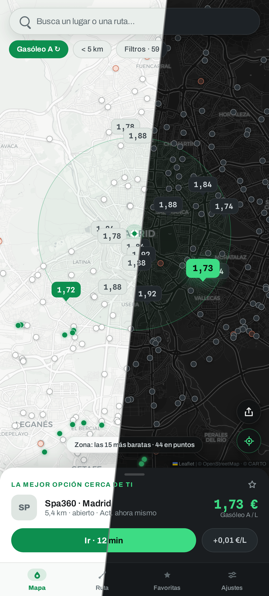
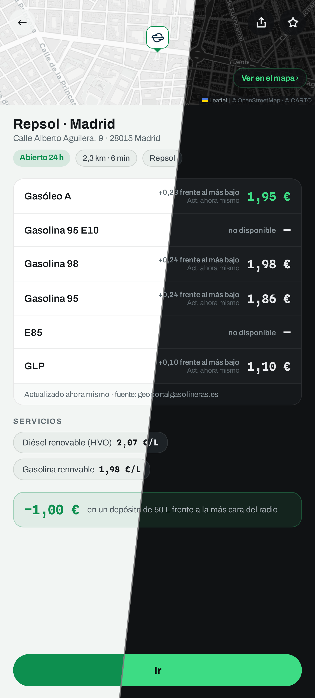
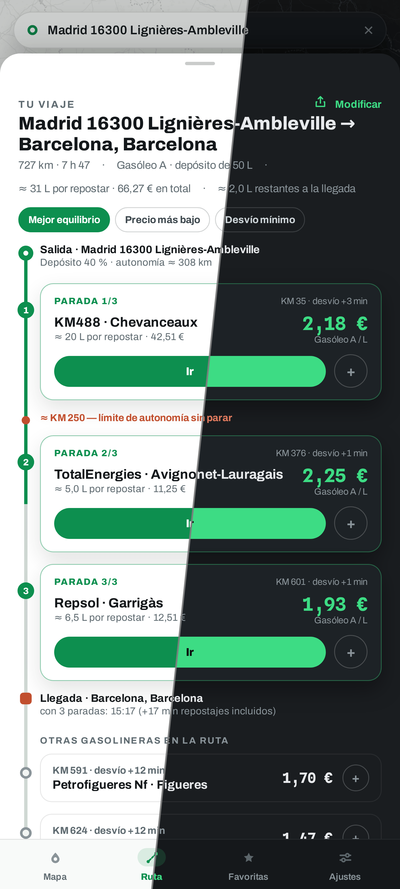

<div align="center">


# Plein.

**El depósito lleno al precio justo** — encuentra las gasolineras más baratas
a tu alrededor y a lo largo de tus rutas, en Francia, España, Andorra y
Portugal.

[English](README.md) · [Français](README.fr.md) · **Español** · [Català](README.ca.md) · [Português](README.pt.md)

[](https://plein.zadkiel.fr)

[](LICENSE)
[](#-uso)
[](#-fuentes-de-datos)
[](https://react.dev)
[](https://www.typescriptlang.org)
[](https://leafletjs.com)

<br/>

| Los precios a tu alrededor | La ficha de una estación | En tu ruta |
| :---: | :---: | :---: |
|  |  |  |

</div>

## ✨ Funcionalidades

- 🗺️ **Mapa de precios en directo** — las estaciones a tu alrededor, precios
  en chinchetas coloreadas según el precio: chollos en verde, las más caras
  en naranja.
- 🇫🇷🇪🇸🇦🇩🇵🇹 **Cuatro países en un mapa** — los flujos oficiales de Francia,
  España, Andorra y Portugal combinados; los repostajes fronterizos se
  comparan de un vistazo.
- 📋 **Mejor elección real** — el combustible quemado en el desvío se tiene
  en cuenta: una estación más cercana puede ganar a la más barata.
- 🛣️ **Plan de repostaje en ruta** — dónde parar a lo largo del viaje,
  cuántos litros en cada parada y a qué precio, según 3 estrategias.
- ⭐ **Favoritos** — tus estaciones y su precio del día, a través de zonas y
  países.
- ⛽ **Todos los combustibles** — Diésel, SP95/98, E10, E85, GLP; filtros por
  radio, rótulos, servicios y AdBlue.
- 🕐 **Horarios reales** — «Abierto 24 h», «Cerrado · abre a las 6:30» — con
  la frescura de los precios señalada.
- 🏷️ **Marcas reconocidas** — nombres y logotipos de las estaciones desde los
  flujos oficiales y OpenStreetMap.
- 🧭 **«Cómo llegar»** — abre la estación en tu app de GPS.
- 🔗 **Enlaces compartibles** — la dirección sigue al mapa y a la ruta; un
  enlace reabre la misma vista.
- 🌗 **Tema claro y oscuro** — sigue a tu navegador, modificable en los
  Ajustes.
- 🌍 **Cinco idiomas** — francés, inglés, español, catalán y portugués.
- 🖥️ **Móvil y escritorio** — mapa a pantalla completa y panel en el móvil,
  paneles laterales en pantalla grande.
- 📱 **PWA instalable** — las últimas zonas y teselas funcionan sin conexión.

## 🚀 Uso

1. Abre **[plein.zadkiel.fr](https://plein.zadkiel.fr)** (el despliegue oficial).
2. Autoriza la geolocalización — o continúa sin ella y busca una ciudad, en
   Francia, España, Andorra o Portugal. La búsqueda recuerda los lugares que
   has elegido: los propone nada más abrirse y los sube al principio de las
   sugerencias en cuanto escribes.
3. Elige tu combustible en la parte superior del mapa: la mejor elección
   (precio Y distancia, desvío incluido) aparece en el panel inferior, **Cómo
   llegar** inicia la navegación.
4. Antes de un viaje largo, pestaña **Ruta**: introduce el destino y compara
   las estaciones a lo largo del recorrido.
5. En el móvil, instala la app (banner de instalación o
   *Ajustes → Aplicación*) para tenerla como icono, a pantalla completa y sin
   conexión.

Sin cuenta, sin rastreadores: tus favoritos y ajustes se quedan en tu navegador.

## 📊 Fuentes de datos

Cada país cubierto tiene sus propios flujos oficiales — precios y
geocodificación — que la app elige según la zona mostrada (fuente
*Automática*). El resto (rutas, mapas base) es común a los cuatro.

### 🇫🇷 Francia

| Dato | Fuente | Licencia |
| --- | --- | --- |
| Precios de los carburantes y horarios | [Prix des carburants — flujo en tiempo real](https://data.economie.gouv.fr/explore/dataset/prix-des-carburants-en-france-flux-instantane-v2/) (data.economie.gouv.fr) | Licence Ouverte / Open Licence |
| Rótulos de las estaciones | [OpenStreetMap](https://www.openstreetmap.org/) (índice estático generado, emparejado con las estaciones por proximidad) | ODbL |
| Geocodificación y autocompletado | [Base Adresse Nationale](https://adresse.data.gouv.fr/) (api-adresse.data.gouv.fr) | Licence Ouverte / Open Licence |

### 🇪🇸 España

| Dato | Fuente | Licencia |
| --- | --- | --- |
| Precios de carburantes, horarios y rótulos | [Precios de carburantes](https://geoportalgasolineras.es) (sedeaplicaciones.minetur.gob.es, MITECO) — el rótulo lo aporta el flujo | Datos abiertos |
| Geocodificación y autocompletado | [CartoCiudad](https://www.cartociudad.es) (IGN) | CC BY 4.0 |

### 🇦🇩 Andorra

| Dato | Fuente | Licencia |
| --- | --- | --- |
| Precios de carburantes y marcas | [Preus dels carburants](https://sig.govern.ad/IPE/PreusCarburants) (sig.govern.ad, Govern d'Andorra — Oficina de l'Energia i del Canvi Climàtic) — la marca se deduce del nombre de la estación; el flujo no incluye ni dirección ni horarios | © Govern d'Andorra |
| Geocodificación y autocompletado | Nomenclàtor (nomenclátor oficial) & LocatorIDE (sig.govern.ad, IDE Andorra) | © Govern d'Andorra |

### 🇵🇹 Portugal

| Dato | Fuente | Licencia |
| --- | --- | --- |
| Precios de carburantes y marcas | [Preços dos combustíveis](https://precoscombustiveis.dgeg.gov.pt) (DGEG — Direção-Geral de Energia e Geologia) — la marca la aporta el flujo, que no da ni horarios ni E10; cobertura continental (las Azores y Madeira tienen su propio régimen) | Dados abertos |
| Geocodificación y autocompletado | [Photon](https://photon.komoot.io) (instancia pública de Komoot, índice OpenStreetMap), limitado al Portugal continental — el país no publica ningún geocodificador de direcciones sin clave | ODbL |

### Comunes a los cuatro países

| Dato | Fuente | Licencia |
| --- | --- | --- |
| Cálculo de rutas | [OSRM](https://project-osrm.org/) (servidor de demostración) · [Valhalla](https://valhalla.github.io/valhalla/) (servidor público FOSSGIS) para «evitar autopistas / peajes» | © colaboradores de [OpenStreetMap](https://www.openstreetmap.org/copyright) |
| Mapas base | [CARTO](https://carto.com/attributions) claro / oscuro según el tema (teselas de OpenStreetMap como respaldo sin conexión) | © colaboradores de [OpenStreetMap](https://www.openstreetmap.org/copyright) |

La app no tiene **ningún backend**: el navegador consulta directamente estos
servicios públicos. Las fuentes son conectables (`src/data/types.ts`). Sin
conexión o con un flujo caído, la app conserva las últimas estaciones
cargadas (caché por zona) con un banner explícito y reintenta en cuanto
vuelve la conexión.

## 🛠️ Desarrollo

Stack: **Vite · React 18 · TypeScript estricto · Leaflet**, sin otra
dependencia de runtime. Desplegado en Cloudflare Workers (`wrangler`).

```bash
npm install
npm run dev          # http://localhost:5173
npm run build        # compilación de producción (dist/)
npm run e2e          # E2E Playwright: recorre todas las pantallas
npm run verify:live  # comprueba los proveedores reales (Francia, España, Andorra, Portugal, geocodificadores, OSRM) contra los endpoints reales
npm run deploy       # build + wrangler deploy
```

Para añadir una fuente de datos: implementar las interfaces
`StationsProvider` / `GeocodeProvider` / `RouteProvider` y registrarla en
`src/data/providers.ts`.

En entornos sin acceso directo a internet (sandbox, proxy corporativo), el
servidor de desarrollo de Vite hace de proxy para las APIs (`/proxy/*`) y las
teselas (`/tiles/*`) respetando `HTTPS_PROXY` — ver `vite.config.ts`.

## 📄 Licencia

Código bajo licencia [MIT](LICENSE) © Zadkiel Aharonian.
Los datos mostrados siguen sujetos a las licencias de sus respectivos
productores (Licence Ouverte para los datos públicos franceses, datos
abiertos del MITECO para los precios españoles, © Govern d'Andorra para
Andorra, dados abertos de la DGEG para los precios portugueses, ODbL para
OpenStreetMap).
Las tipografías **Archivo** y **Spline Sans Mono**, incluidas en
`public/fonts/`, están bajo la [SIL Open Font License 1.1](public/fonts/)
(ver los archivos `*-OFL.txt` de la misma carpeta).
