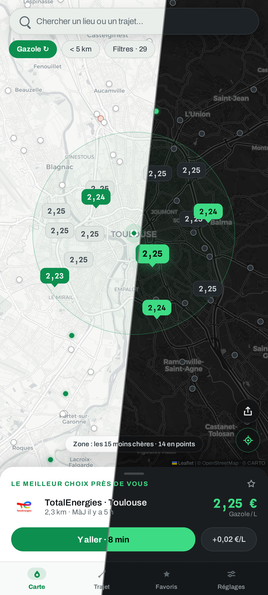
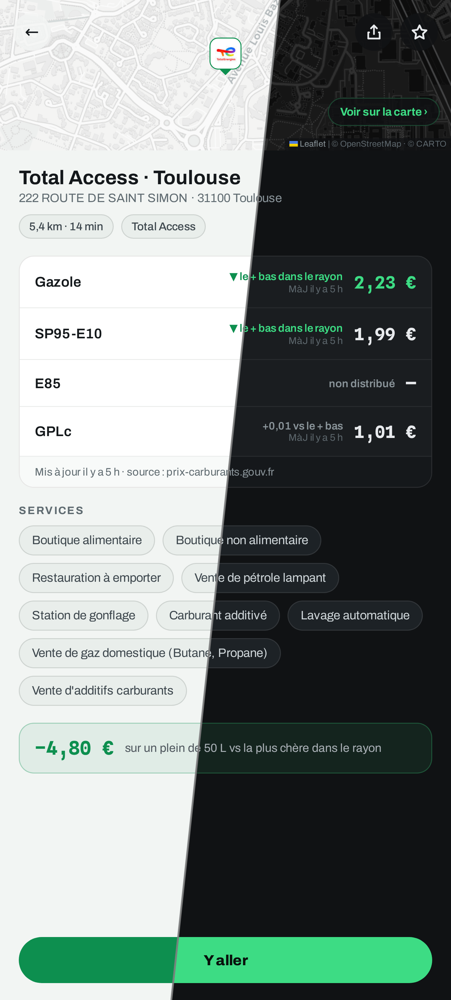
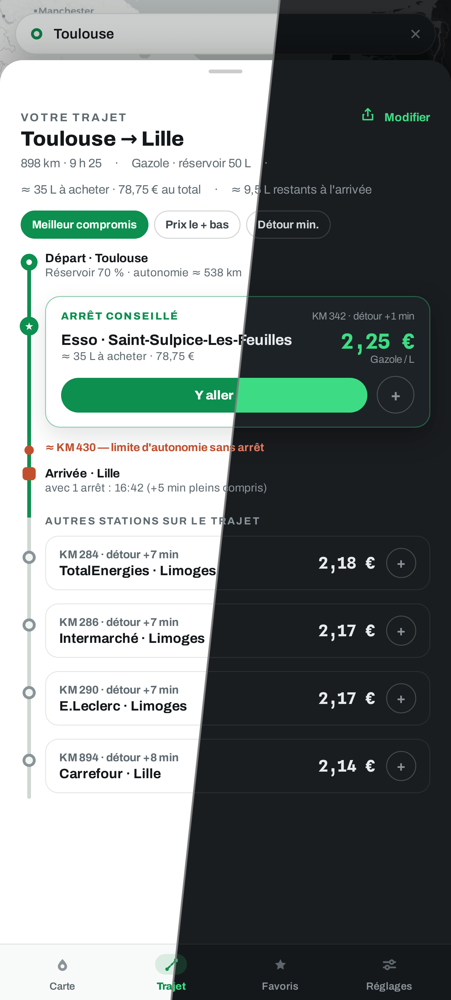

<div align="center">


# Plein.

**Le plein au juste prix** — trouvez les stations-service les moins chères
autour de vous et le long de vos trajets, en France, en Espagne, en Andorre et
au Portugal.

[English](README.md) · **Français** · [Español](README.es.md) · [Català](README.ca.md) · [Português](README.pt.md)

[](https://plein.zadkiel.fr)

[](LICENSE)
[](#-utilisation)
[](#-sources-de-données)
[](https://react.dev)
[](https://www.typescriptlang.org)
[](https://leafletjs.com)

<br/>

| Les prix autour de vous | La fiche d'une station | Sur votre trajet |
| :---: | :---: | :---: |
|  |  |  |

</div>

## ✨ Fonctionnalités

- 🗺️ **Carte des prix en direct** — les stations autour de vous, prix en pin
  colorés selon le prix : bons plans en vert, les plus chères en orange.
- 🇫🇷🇪🇸🇦🇩🇵🇹 **Quatre pays sur une carte** — les flux officiels de la France,
  de l'Espagne, de l'Andorre et du Portugal combinés ; les pleins frontaliers
  se comparent d'un coup d'œil.
- 📋 **Meilleur choix réel** — le carburant brûlé pour le détour est compté :
  une station plus proche peut battre la moins chère.
- 🛣️ **Plan carburant du trajet** — où s'arrêter le long du parcours, combien
  de litres à chaque arrêt et à quel prix, selon 3 stratégies.
- ⭐ **Favoris** — vos stations et leur prix du jour, à travers zones et pays.
- ⛽ **Tous les carburants** — Gazole, SP95/98, E10, E85, GPLc ; filtres par
  rayon, enseignes, services et AdBlue.
- 🕐 **Horaires réels** — « Ouvert 24/24 », « Fermé · ouvre à 6 h 30 » — avec
  la fraîcheur des prix signalée.
- 🏷️ **Enseignes reconnues** — noms et logos des stations depuis les flux
  officiels et OpenStreetMap.
- 🧭 **« Y aller »** — ouvre la station dans votre app GPS.
- 🔗 **Liens partageables** — l'adresse suit la carte et le trajet ; un lien
  rouvre la même vue.
- 🌗 **Thème clair et sombre** — suit votre navigateur, modifiable dans les
  Réglages.
- 🌍 **Cinq langues** — français, anglais, espagnol, catalan et portugais.
- 🖥️ **Téléphone et grand écran** — carte plein écran et volet sur mobile,
  panneaux latéraux sur grand écran.
- 📱 **PWA installable** — les dernières zones et tuiles fonctionnent
  hors-ligne.

## 🚀 Utilisation

1. Ouvrez **[plein.zadkiel.fr](https://plein.zadkiel.fr)** (le déploiement officiel).
2. Autorisez la géolocalisation — ou continuez sans, et cherchez une ville, en
   France, en Espagne, en Andorre ou au Portugal. La recherche retient les lieux
   que vous y avez choisis : elle les propose dès son ouverture et les remonte
   en tête des suggestions dès que vous tapez.
3. Choisissez votre carburant en haut de la carte : le meilleur choix (prix ET
   distance, détour compté) apparaît dans le volet du bas, **Y aller** lance le
   guidage.
4. Avant de partir loin, onglet **Trajet** : saisissez la destination et
   comparez les stations le long du parcours.
5. Sur mobile, installez l'app (bannière d'installation ou
   *Réglages → Application*) pour l'avoir en icône, plein écran et hors-ligne.

Aucun compte, aucun tracker : vos favoris et réglages restent dans votre navigateur.

## 📊 Sources de données

Chaque pays couvert a ses propres flux officiels — prix et géocodage — que
l'app choisit selon la zone affichée (source *Automatique*). Le reste
(itinéraires, fonds de carte) est commun aux quatre.

### 🇫🇷 France

| Donnée | Source | Licence |
| --- | --- | --- |
| Prix des carburants & horaires | [Prix des carburants — flux temps réel](https://data.economie.gouv.fr/explore/dataset/prix-des-carburants-en-france-flux-instantane-v2/) (data.economie.gouv.fr) | Licence Ouverte / Open Licence |
| Enseignes des stations | [OpenStreetMap](https://www.openstreetmap.org/) (index statique généré, rapproché des stations par proximité) | ODbL |
| Géocodage & autocomplétion | [Base Adresse Nationale](https://adresse.data.gouv.fr/) (api-adresse.data.gouv.fr) | Licence Ouverte / Open Licence |

### 🇪🇸 Espagne

| Donnée | Source | Licence |
| --- | --- | --- |
| Prix des carburants, horaires & enseignes | [Precios de carburantes](https://geoportalgasolineras.es) (sedeaplicaciones.minetur.gob.es, MITECO) — l'enseigne (*rótulo*) est portée par le flux | Datos abiertos |
| Géocodage & autocomplétion | [CartoCiudad](https://www.cartociudad.es) (IGN) | CC BY 4.0 |

### 🇦🇩 Andorre

| Donnée | Source | Licence |
| --- | --- | --- |
| Prix des carburants & enseignes | [Preus dels carburants](https://sig.govern.ad/IPE/PreusCarburants) (sig.govern.ad, Govern d'Andorra — Oficina de l'energia i del canvi climàtic) — l'enseigne est déduite du nom de la station ; le flux ne porte ni adresse ni horaires | © Govern d'Andorra |
| Géocodage & autocomplétion | Nomenclàtor (gazetteer officiel) & LocatorIDE (sig.govern.ad, IDE Andorra) | © Govern d'Andorra |

### 🇵🇹 Portugal

| Donnée | Source | Licence |
| --- | --- | --- |
| Prix des carburants & enseignes | [Preços dos combustíveis](https://precoscombustiveis.dgeg.gov.pt) (DGEG — Direção-Geral de Energia e Geologia) — l'enseigne (*marca*) est portée par le flux, qui ne donne ni horaires ni E10 ; couverture continentale (les Açores et Madère ont leur propre régime) | Dados abertos |
| Géocodage & autocomplétion | [Photon](https://photon.komoot.io) (instance publique Komoot, index OpenStreetMap), borné au Portugal continental — le pays ne publie pas de géocodeur d'adresses sans clé | ODbL |

### Communs aux quatre pays

| Donnée | Source | Licence |
| --- | --- | --- |
| Calcul d'itinéraires | [OSRM](https://project-osrm.org/) (serveur démo) · [Valhalla](https://valhalla.github.io/valhalla/) (serveur public FOSSGIS) pour « éviter autoroutes / péages » | Données © OpenStreetMap |
| Fonds de carte | [CARTO](https://carto.com/attributions) clair / sombre selon le thème (tuiles OpenStreetMap en secours hors-ligne) · données © contributeurs [OpenStreetMap](https://www.openstreetmap.org/copyright) | — |

L'app n'a **aucun backend** : le navigateur interroge directement ces services
publics. Les sources sont pluggables (`src/data/types.ts`). Hors connexion ou
flux indisponible, l'app garde les dernières stations chargées (cache par
zone) avec une bannière explicite et réessaie dès que la connexion revient ;
un jeu de données de démonstration hors-ligne reste sélectionnable dans les
réglages.

## 🛠️ Développement

Stack : **Vite · React 18 · TypeScript strict · Leaflet**, sans autre dépendance
runtime. Déployé sur Cloudflare Workers (`wrangler`).

```bash
npm install
npm run dev          # http://localhost:5173
npm run build        # build de production (dist/)
npm run e2e          # E2E Playwright : parcourt tous les écrans
npm run verify:live  # vérifie les providers réels (France, Espagne, Andorre, Portugal, géocodeurs, OSRM) contre les vrais endpoints
npm run deploy       # build + wrangler deploy
```

Pour ajouter une source de données : implémenter les interfaces
`StationsProvider` / `GeocodeProvider` / `RouteProvider` et l'enregistrer dans
`src/data/providers.ts`.

En environnement sans accès internet direct (sandbox, proxy d'entreprise), le
dev server Vite proxifie les APIs (`/proxy/*`) et les tuiles (`/tiles/*`) en
respectant `HTTPS_PROXY` — voir `vite.config.ts`.

## 📄 Licence

Code sous licence [MIT](LICENSE) © Zadkiel Aharonian.
Les données affichées restent soumises aux licences de leurs producteurs
respectifs (Licence Ouverte pour les données publiques françaises, datos
abiertos du MITECO pour les prix espagnols, © Govern d'Andorra pour l'Andorre,
dados abertos de la DGEG pour les prix portugais, ODbL pour OpenStreetMap).
Les polices **Archivo** et **Spline Sans Mono**, embarquées dans
`public/fonts/`, sont sous [SIL Open Font License 1.1](public/fonts/) (voir les
fichiers `*-OFL.txt` du même dossier).
