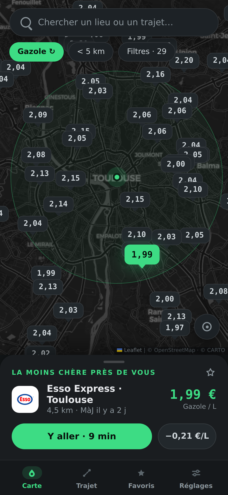
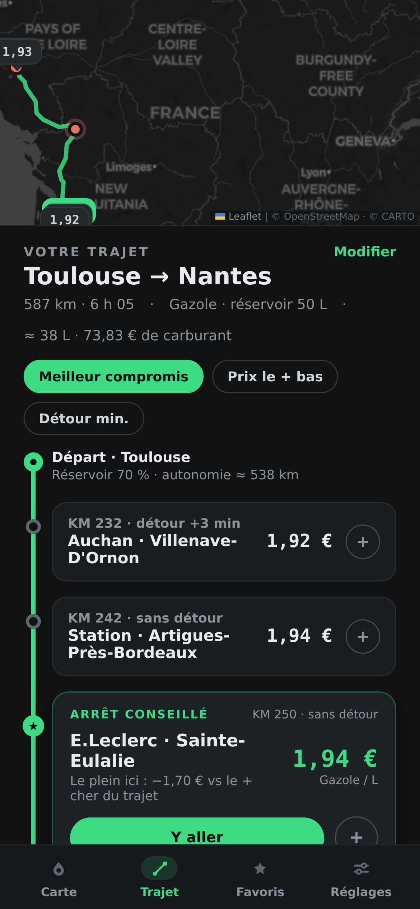

<div align="center">


# Plein.

**Le plein au juste prix** — trouvez les stations-service les moins chères
autour de vous et le long de vos trajets, partout en France.

[](https://plein.zadkiel.fr)

[](LICENSE)
[](#-utilisation)
[](#-sources-de-données)
[](https://react.dev)
[](https://www.typescriptlang.org)
[](https://leafletjs.com)

<br/>

| Les prix autour de vous *(Toulouse)* | Sur votre trajet *(Toulouse → Nantes)* |
| :---: | :---: |
|  |  |

</div>

## ✨ Fonctionnalités

- 🗺️ **Carte des prix en direct** — les stations autour de vous avec leur prix en
  pin, colorés selon le prix : les « bons plans » (toutes les stations quasi au
  meilleur prix, pas seulement la première) en vert, les plus chères teintées
  orange ; déplacez la carte, les stations de la zone se chargent automatiquement.
- 📋 **Liste de la zone** — tirez le volet du bas : toutes les stations visibles,
  triables par prix ou distance, les bons plans surlignés, synchronisées avec la
  carte.
- 🛣️ **Comparateur de trajet** — départ « Ma position » ou n'importe quelle
  adresse, autocomplétion, carte du corridor et **arrêt conseillé** selon
  3 stratégies (meilleur compromis · prix le plus bas · détour minimal), avec
  limite d'autonomie du réservoir et coût carburant estimé du trajet.
- ⭐ **Favoris** — épinglez vos stations, retrouvez leur prix du jour d'un coup d'œil.
- ⛽ **Tous les carburants** — Gazole, SP95/98, E10, E85, GPLc ; filtres par
  rayon, enseignes et services.
- 🕐 **Horaires réels** — « Ouvert 24/24 », « Fermé · ouvre à 6 h 30 »… calculés
  depuis les horaires officiels ; fraîcheur des prix affichée (et signalée quand
  ils datent).
- 🏷️ **Enseignes reconnues** — logos et noms des stations (TotalEnergies,
  E.Leclerc, Intermarché…) appariés depuis OpenStreetMap.
- 🧭 **« Y aller »** — ouvre votre app GPS : choix de l'app sur Android (`geo:`),
  Plans sur iOS, Google Maps sur desktop ; tournée multi-arrêts possible.
- 📱 **PWA installable et tolérante au hors-ligne** — ajoutez-la à l'écran
  d'accueil ; les dernières zones consultées et les tuiles de carte restent
  disponibles sans réseau, avec indicateur d'ancienneté des prix.

## 🚀 Utilisation

1. Ouvrez **[plein.zadkiel.fr](https://plein.zadkiel.fr)** (le déploiement officiel).
2. Autorisez la géolocalisation — ou continuez sans, et cherchez une ville.
3. Choisissez votre carburant en haut de la carte : la station la moins chère
   apparaît dans le volet du bas, **Y aller** lance le guidage.
4. Avant de partir loin, onglet **Trajet** : saisissez la destination et
   comparez les stations le long du parcours.
5. Sur mobile, installez l'app (bannière d'installation ou
   *Réglages → Application*) pour l'avoir en icône, plein écran et hors-ligne.

Aucun compte, aucun tracker : vos favoris et réglages restent dans votre navigateur.

## 📊 Sources de données

| Donnée | Source | Licence |
| --- | --- | --- |
| Prix des carburants & horaires | [Prix des carburants — flux temps réel](https://data.economie.gouv.fr/explore/dataset/prix-des-carburants-en-france-flux-instantane-v2/) (data.economie.gouv.fr) | Licence Ouverte / Open Licence |
| Prix des carburants en Espagne | [Precios de carburantes](https://geoportalgasolineras.es) (sedeaplicaciones.minetur.gob.es, MITECO) | Datos abiertos |
| Prix des carburants en Allemagne | [Tankerkönig](https://creativecommons.tankerkoenig.de) (relais du flux officiel MTS-K, Bundeskartellamt) | CC BY 4.0 |
| Géocodage & autocomplétion | [Base Adresse Nationale](https://adresse.data.gouv.fr/) (api-adresse.data.gouv.fr) · [CartoCiudad](https://www.cartociudad.es) pour l'Espagne · [Photon](https://photon.komoot.io) pour l'Allemagne | Licence Ouverte / Open Licence · CC BY 4.0 · ODbL |
| Calcul d'itinéraires | [OSRM](https://project-osrm.org/) (serveur démo) | Données © OpenStreetMap |
| Enseignes des stations | [OpenStreetMap](https://www.openstreetmap.org/) (index statique généré) | ODbL |
| Fonds de carte | [CARTO](https://carto.com/attributions) dark · données © contributeurs [OpenStreetMap](https://www.openstreetmap.org/copyright) | — |

L'app n'a **pas de backend applicatif** : le navigateur interroge directement
ces services publics. Seule exception, la source allemande passe par un mini
proxy sur le Worker qui sert l'app (`worker/index.ts`) — Tankerkönig exige une
clé API personnelle qui ne doit jamais être exposée côté client. Les sources
sont pluggables (`src/data/types.ts`) — un jeu de données de démonstration
hors-ligne prend automatiquement le relais si le flux réel est indisponible,
avec bannière explicite.

## 🛠️ Développement

Stack : **Vite · React 18 · TypeScript strict · Leaflet**, sans autre dépendance
runtime. Déployé sur Cloudflare Workers (`wrangler`).

```bash
npm install
npm run dev          # http://localhost:5173
npm run build        # build de production (dist/)
npm run e2e          # E2E Playwright : parcourt tous les écrans
npm run verify:live  # vérifie les providers réels (gouv/BAN/OSRM) contre les vrais endpoints
npm run deploy       # build + wrangler deploy
```

Pour ajouter une source de données : implémenter les interfaces
`StationsProvider` / `GeocodeProvider` / `RouteProvider` et l'enregistrer dans
`src/data/providers.ts`.

En environnement sans accès internet direct (sandbox, proxy d'entreprise), le
dev server Vite proxifie les APIs (`/proxy/*`) et les tuiles (`/tiles/*`) en
respectant `HTTPS_PROXY` — voir `vite.config.ts`.

La source allemande (Tankerkönig) demande une **clé API personnelle** —
gratuite, sur [tankerkoenig.de](https://creativecommons.tankerkoenig.de). Les
CGU interdisent de publier une clé (repo, bundle…) : elle ne transite donc
jamais par le client. En dev, exportez `TANKERKOENIG_API_KEY` avant
`npm run dev` (le proxy Vite l'injecte côté serveur) ; en production, stockez-la
en secret Worker : `wrangler secret put TANKERKOENIG_API_KEY` (le Worker
proxifie l'API avec un cache edge de 5 min — `worker/index.ts`). Sans clé, la
source allemande se déclare simplement indisponible.

## 📄 Licence

Code sous licence [MIT](LICENSE) © Zadkiel Aharonian.
Les données affichées restent soumises aux licences de leurs producteurs
respectifs (Licence Ouverte pour les données publiques françaises, ODbL pour
OpenStreetMap).
