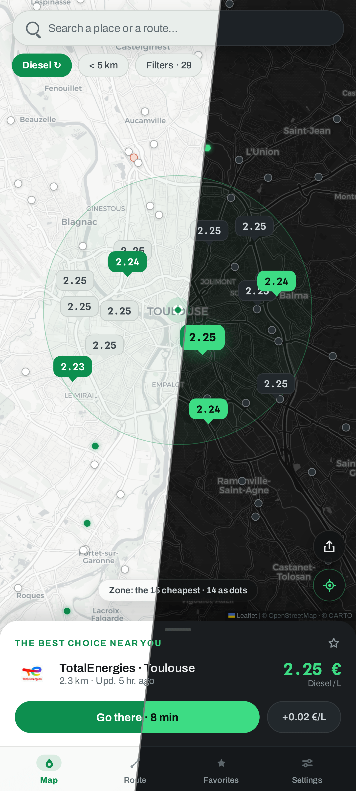
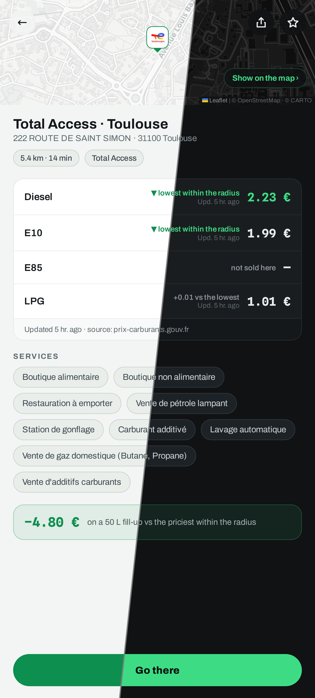
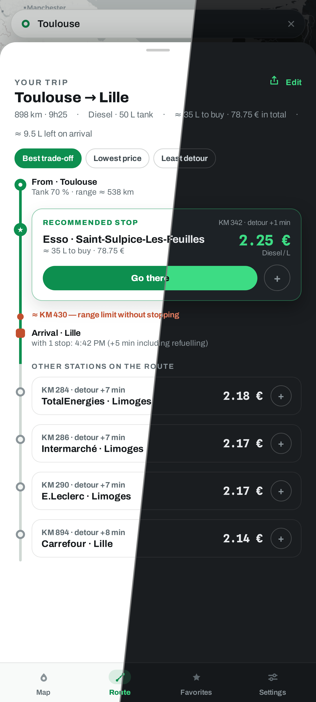

<div align="center">


# Plein.

**A full tank at the right price** — find the cheapest fuel stations around
you and along your routes, in France, Spain, Andorra and Portugal.

**English** · [Français](README.fr.md) · [Español](README.es.md) · [Català](README.ca.md) · [Português](README.pt.md)

[](https://plein.zadkiel.fr)

[](LICENSE)
[](#-usage)
[](#-data-sources)
[](https://react.dev)
[](https://www.typescriptlang.org)
[](https://leafletjs.com)

<br/>

| Prices around you | A station's page | Along your route |
| :---: | :---: | :---: |
|  |  |  |

</div>

## ✨ Features

- 🗺️ **Live price map** — price pins around you, best deals in green
- 🇫🇷🇪🇸🇦🇩🇵🇹 **Four countries** — the official feeds combined on one map
- 📋 **Real best choice** — the fuel of the detour is counted
- 🛣️ **Route fuel plan** — where to stop, how many liters, at what cost
- ⭐ **Favorites** — the day's prices at a glance
- ⛽ **All fuels** — Diesel, SP95/98, E10, E85, LPG · brand, service and AdBlue filters
- 🕐 **Real opening hours** — and price freshness
- 🏷️ **Recognized brands** — names and logos
- 🧭 **Directions** — opens your GPS app
- 🔗 **Shareable links** — for a map view or a trip
- 🌗 **Light and dark themes**
- 🌍 **Five languages** — FR · EN · ES · CA · PT
- 🖥️ **Phone and desktop**
- 📱 **Installable PWA** — offline-tolerant

## 🚀 Usage

1. Open **[plein.zadkiel.fr](https://plein.zadkiel.fr)** (the official deployment).
2. Allow geolocation — or continue without it, and search for a city in
   France, Spain, Andorra or Portugal. The search remembers the places you
   picked there: it offers them as soon as it opens and ranks them at the top
   of the suggestions as soon as you type.
3. Pick your fuel at the top of the map: the best choice (price AND distance,
   detour counted) shows up in the bottom sheet, **Directions** starts the
   guidance.
4. Before a long trip, open the **Route** tab: enter the destination and
   compare the stations along the way.
5. On mobile, install the app (install banner or *Settings → Application*) to
   get it as an icon, full screen and offline.

No account, no tracker: your favorites and settings stay in your browser.

## 📊 Data sources

Each covered country has its own official feeds — prices and geocoding —
which the app picks according to the visible area (*Automatic* source). The
rest (routing, basemaps) is shared by all four.

### 🇫🇷 France

| Data | Source | License |
| --- | --- | --- |
| Fuel prices & opening hours | [Prix des carburants — real-time feed](https://data.economie.gouv.fr/explore/dataset/prix-des-carburants-en-france-flux-instantane-v2/) (data.economie.gouv.fr) | Licence Ouverte / Open Licence |
| Station brands | [OpenStreetMap](https://www.openstreetmap.org/) (generated static index, matched to stations by proximity) | ODbL |
| Geocoding & autocompletion | [Base Adresse Nationale](https://adresse.data.gouv.fr/) (api-adresse.data.gouv.fr) | Licence Ouverte / Open Licence |

### 🇪🇸 Spain

| Data | Source | License |
| --- | --- | --- |
| Fuel prices, hours & brands | [Precios de carburantes](https://geoportalgasolineras.es) (sedeaplicaciones.minetur.gob.es, MITECO) — the brand (*rótulo*) is carried by the feed | Datos abiertos |
| Geocoding & autocompletion | [CartoCiudad](https://www.cartociudad.es) (IGN) | CC BY 4.0 |

### 🇦🇩 Andorra

| Data | Source | License |
| --- | --- | --- |
| Fuel prices & brands | [Preus dels carburants](https://sig.govern.ad/IPE/PreusCarburants) (sig.govern.ad, Govern d'Andorra — Oficina de l'energia i del canvi climàtic) — the brand is derived from the station name; the feed carries neither address nor opening hours | © Govern d'Andorra |
| Geocoding & autocompletion | Nomenclàtor (official gazetteer) & LocatorIDE (sig.govern.ad, IDE Andorra) | © Govern d'Andorra |

### 🇵🇹 Portugal

| Data | Source | License |
| --- | --- | --- |
| Fuel prices & brands | [Preços dos combustíveis](https://precoscombustiveis.dgeg.gov.pt) (DGEG — Direção-Geral de Energia e Geologia) — the brand (*marca*) is carried by the feed, which gives neither opening hours nor E10; mainland coverage (the Azores and Madeira have their own regime) | Dados abertos |
| Geocoding & autocompletion | [Photon](https://photon.komoot.io) (public Komoot instance, OpenStreetMap index), bounded to mainland Portugal — the country publishes no keyless address geocoder | ODbL |

### Shared by all four countries

| Data | Source | License |
| --- | --- | --- |
| Routing | [OSRM](https://project-osrm.org/) (demo server) · [Valhalla](https://valhalla.github.io/valhalla/) (public FOSSGIS server) for "avoid motorways / tolls" | Data © OpenStreetMap |
| Basemaps | [CARTO](https://carto.com/attributions) light / dark following the theme (OpenStreetMap tiles as offline-friendly fallback) · data © [OpenStreetMap](https://www.openstreetmap.org/copyright) contributors | — |

The app has **no backend**: the browser queries these public services
directly. Sources are pluggable (`src/data/types.ts`). Offline or when a feed
is down, the app keeps the last loaded stations (per-area cache) with an
explicit banner and retries as soon as the connection returns; an offline
demo dataset stays selectable in the settings.

## 🛠️ Development

Stack: **Vite · React 18 · strict TypeScript · Leaflet**, no other runtime
dependency. Deployed on Cloudflare Workers (`wrangler`).

```bash
npm install
npm run dev          # http://localhost:5173
npm run build        # production build (dist/)
npm run e2e          # Playwright E2E: walks through every screen
npm run verify:live  # checks the real providers (France, Spain, Andorra, Portugal, geocoders, OSRM) against the live endpoints
npm run deploy       # build + wrangler deploy
```

To add a data source: implement the `StationsProvider` / `GeocodeProvider` /
`RouteProvider` interfaces and register it in `src/data/providers.ts`.

In an environment without direct internet access (sandbox, corporate proxy),
the Vite dev server proxies the APIs (`/proxy/*`) and the tiles (`/tiles/*`)
honoring `HTTPS_PROXY` — see `vite.config.ts`.

## 📄 License

Code under the [MIT](LICENSE) license © Zadkiel Aharonian.
The displayed data remains subject to the licenses of its respective
producers (Licence Ouverte for French public data, MITECO datos abiertos for
Spanish prices, © Govern d'Andorra for Andorra, DGEG dados abertos for
Portuguese prices, ODbL for OpenStreetMap).
The **Archivo** and **Spline Sans Mono** fonts, embedded in `public/fonts/`,
are under the [SIL Open Font License 1.1](public/fonts/) (see the `*-OFL.txt`
files in the same folder).
