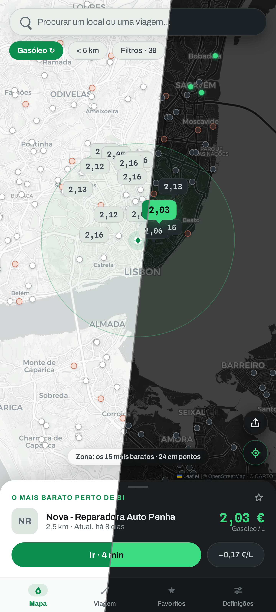
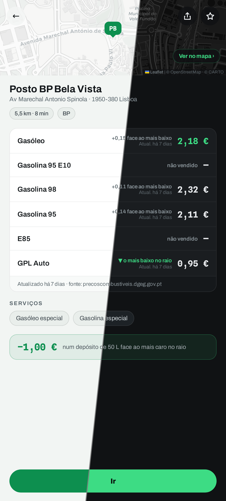
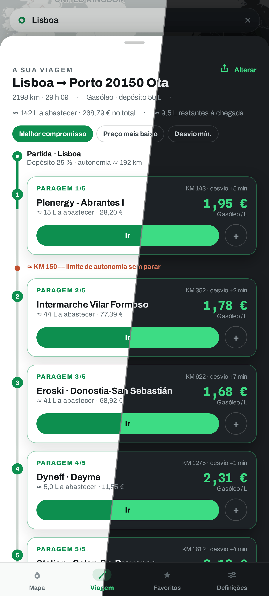

<div align="center">


# Plein.

**O depósito cheio ao preço justo** — encontre os postos de combustível mais
baratos à sua volta e ao longo dos seus trajetos, em França, Espanha,
Andorra, Portugal e Alemanha.

[English](README.md) · [Français](README.fr.md) · [Español](README.es.md) · [Català](README.ca.md) · **Português**

[](https://plein.zadkiel.fr)

[](LICENSE)
[](#-utilização)
[](#-fontes-de-dados)
[](https://react.dev)
[](https://www.typescriptlang.org)
[](https://leafletjs.com)

<br/>

| Os preços à sua volta | A ficha de um posto | No seu trajeto |
| :---: | :---: | :---: |
|  |  |  |

</div>

## ✨ Funcionalidades

- 🗺️ **Mapa de preços em direto** — os postos à sua volta, preços em
  alfinetes coloridos consoante o preço: boas ofertas a verde, os mais caros
  a laranja.
- 🇫🇷🇪🇸🇦🇩🇵🇹🇩🇪 **Cinco países num mapa** — os fluxos oficiais de França,
  Espanha, Andorra, Portugal e Alemanha combinados; os abastecimentos
  fronteiriços comparam-se num relance.
- 📋 **Melhor escolha real** — o combustível gasto no desvio é contabilizado:
  um posto mais próximo pode bater o mais barato.
- 🛣️ **Plano de abastecimento na rota** — onde parar ao longo da viagem,
  quantos litros em cada paragem e a que preço, segundo 3 estratégias.
- ⭐ **Favoritos** — os seus postos e o preço do dia, através de zonas e
  países.
- ⛽ **Todos os combustíveis** — Gasóleo, SP95/98, E10, E85, GPL; filtros por
  raio, marcas, serviços e AdBlue.
- 🕐 **Horários reais** — «Aberto 24 h», «Fechado · abre às 6h30» — com a
  frescura dos preços assinalada.
- 🏷️ **Marcas reconhecidas** — nomes e logótipos dos postos a partir dos
  fluxos oficiais e do OpenStreetMap.
- 🧭 **«Direções»** — abre o posto na sua app de GPS.
- 🔗 **Ligações partilháveis** — o endereço segue o mapa e o trajeto; uma
  ligação reabre a mesma vista.
- 🌗 **Tema claro e escuro** — segue o navegador, alterável nas Definições.
- 🌍 **Cinco línguas** — francês, inglês, espanhol, catalão e português.
- 🖥️ **Telemóvel e computador** — mapa em ecrã inteiro e painel no telemóvel,
  painéis laterais no ecrã grande.
- 📱 **PWA instalável** — as últimas zonas e mosaicos funcionam offline.

## 🚀 Utilização

1. Abra **[plein.zadkiel.fr](https://plein.zadkiel.fr)** (a implantação oficial).
2. Autorize a geolocalização — ou continue sem ela e procure uma cidade, em
   França, Espanha, Andorra, Portugal ou Alemanha. A pesquisa lembra-se dos locais que
   escolheu: propõe-nos assim que abre e coloca-os no topo das sugestões mal
   comece a escrever.
3. Escolha o combustível no topo do mapa: a melhor escolha (preço E
   distância, desvio contabilizado) aparece no painel inferior, **Direções**
   inicia a navegação.
4. Antes de uma viagem longa, separador **Trajeto**: introduza o destino e
   compare os postos ao longo do percurso.
5. No telemóvel, instale a app (faixa de instalação ou
   *Definições → Aplicação*) para a ter como ícone, em ecrã inteiro e
   offline.

Sem conta, sem rastreadores: os seus favoritos e definições ficam no seu
navegador.

## 📊 Fontes de dados

Cada país coberto tem os seus próprios fluxos oficiais — preços e
geocodificação — que a app escolhe consoante a zona apresentada (fonte
*Automática*). O resto (itinerários, mapas base) é comum aos cinco.

### 🇫🇷 França

| Dado | Fonte | Licença |
| --- | --- | --- |
| Preços dos combustíveis e horários | [Prix des carburants — fluxo em tempo real](https://data.economie.gouv.fr/explore/dataset/prix-des-carburants-en-france-flux-instantane-v2/) (data.economie.gouv.fr) | Licence Ouverte / Open Licence |
| Marcas dos postos | [OpenStreetMap](https://www.openstreetmap.org/) (índice estático gerado, associado aos postos por proximidade) | ODbL |
| Geocodificação e preenchimento automático | [Base Adresse Nationale](https://adresse.data.gouv.fr/) (api-adresse.data.gouv.fr) | Licence Ouverte / Open Licence |

### 🇪🇸 Espanha

| Dado | Fonte | Licença |
| --- | --- | --- |
| Preços dos combustíveis, horários e marcas | [Precios de carburantes](https://geoportalgasolineras.es) (sedeaplicaciones.minetur.gob.es, MITECO) — a marca (*rótulo*) vem no fluxo | Datos abiertos |
| Geocodificação e preenchimento automático | [CartoCiudad](https://www.cartociudad.es) (IGN) | CC BY 4.0 |

### 🇦🇩 Andorra

| Dado | Fonte | Licença |
| --- | --- | --- |
| Preços dos combustíveis e marcas | [Preus dels carburants](https://sig.govern.ad/IPE/PreusCarburants) (sig.govern.ad, Govern d'Andorra — Oficina de l'Energia i del Canvi Climàtic) — a marca é deduzida do nome do posto; o fluxo não traz morada nem horários | © Govern d'Andorra |
| Geocodificação e preenchimento automático | Nomenclàtor (dicionário geográfico oficial) & LocatorIDE (sig.govern.ad, IDE Andorra) | © Govern d'Andorra |

### 🇵🇹 Portugal

| Dado | Fonte | Licença |
| --- | --- | --- |
| Preços dos combustíveis e marcas | [Preços dos combustíveis](https://precoscombustiveis.dgeg.gov.pt) (DGEG — Direção-Geral de Energia e Geologia) — a marca (*marca*) vem no fluxo, que não dá horários nem E10; cobertura continental (os Açores e a Madeira têm o seu próprio regime) | Dados abertos |
| Geocodificação e preenchimento automático | [Photon](https://photon.komoot.io) (instância pública da Komoot, índice OpenStreetMap), limitado a Portugal continental — o país não publica nenhum geocodificador de moradas sem chave | ODbL |

### 🇩🇪 Alemanha

| Dado | Fonte | Licença |
| --- | --- | --- |
| Preços dos combustíveis e marcas | [Tankerkönig](https://creativecommons.tankerkoenig.de) (retransmissor aberto do fluxo oficial MTS-K — Markttransparenzstelle für Kraftstoffe, Bundeskartellamt) — a marca vem no fluxo, que não dá serviços nem horários semanais; é precisa uma chave API pessoal que fica no servidor (ver [Desenvolvimento](#%EF%B8%8F-desenvolvimento)) | CC BY 4.0 |
| Geocodificação e preenchimento automático | [Photon](https://photon.komoot.io) (instância pública da Komoot, índice OpenStreetMap), limitado à Alemanha — os geocodificadores oficiais do BKG exigem registo | ODbL |

### Comuns aos cinco países

| Dado | Fonte | Licença |
| --- | --- | --- |
| Cálculo de itinerários | [OSRM](https://project-osrm.org/) (servidor de demonstração) · [Valhalla](https://valhalla.github.io/valhalla/) (servidor público FOSSGIS) para «evitar autoestradas / portagens» | © colaboradores do [OpenStreetMap](https://www.openstreetmap.org/copyright) |
| Mapas base | [CARTO](https://carto.com/attributions) claro / escuro consoante o tema (mosaicos do OpenStreetMap como recurso offline) | © colaboradores do [OpenStreetMap](https://www.openstreetmap.org/copyright) |

A app não tem **nenhum backend**: o navegador consulta diretamente estes
serviços públicos. A única exceção é a fonte alemã — o Tankerkönig exige uma
chave API pessoal que nunca deve chegar ao cliente, por isso o Worker que
serve a app faz-lhe de proxy (`worker/index.ts`). As fontes são conectáveis
(`src/data/types.ts`). Sem ligação ou com um fluxo indisponível, a app
mantém os últimos postos carregados (cache por zona) com uma faixa explícita
e tenta de novo assim que a ligação volta.

## 🛠️ Desenvolvimento

Stack: **Vite · React 18 · TypeScript estrito · Leaflet**, sem outra
dependência de runtime. Implantado em Cloudflare Workers (`wrangler`).

```bash
npm install
npm run dev          # http://localhost:5173
npm run build        # build de produção (dist/)
npm run e2e          # E2E Playwright: percorre todos os ecrãs
npm run verify:live  # verifica os fornecedores reais (França, Espanha, Andorra, Portugal, Alemanha, geocodificadores, OSRM) contra os endpoints reais
npm run deploy       # build + wrangler deploy
```

Para adicionar uma fonte de dados: implementar as interfaces
`StationsProvider` / `GeocodeProvider` / `RouteProvider` e registá-la em
`src/data/providers.ts`.

Em ambientes sem acesso direto à internet (sandbox, proxy empresarial), o
servidor de desenvolvimento do Vite faz proxy das APIs (`/proxy/*`) e dos
mosaicos (`/tiles/*`) respeitando `HTTPS_PROXY` — ver `vite.config.ts`.

A fonte alemã (Tankerkönig) requer uma **chave API pessoal** — gratuita, em
[tankerkoenig.de](https://creativecommons.tankerkoenig.de). As condições de
utilização proíbem publicar uma chave (repo, bundle…), por isso nunca passa
pelo cliente. Em desenvolvimento, exporte `TANKERKOENIG_API_KEY` antes de
`npm run dev` (o proxy do Vite injeta-a no servidor); em produção, guarde-a
como segredo do Worker: `wrangler secret put TANKERKOENIG_API_KEY` (o Worker
faz proxy da API com uma cache edge de ~5 min — `worker/index.ts`). Sem
chave, a fonte alemã declara-se simplesmente indisponível.

## 📄 Licença

Código sob licença [MIT](LICENSE) © Zadkiel Aharonian.
Os dados apresentados continuam sujeitos às licenças dos respetivos
produtores (Licence Ouverte para os dados públicos franceses, datos abiertos
do MITECO para os preços espanhóis, © Govern d'Andorra para Andorra, dados
abertos da DGEG para os preços portugueses, CC BY 4.0 para os preços alemães
— Tankerkönig / MTS-K, ODbL para o OpenStreetMap).
Os tipos de letra **Archivo** e **Spline Sans Mono**, incluídos em
`public/fonts/`, estão sob a [SIL Open Font License 1.1](public/fonts/) (ver
os ficheiros `*-OFL.txt` da mesma pasta).
